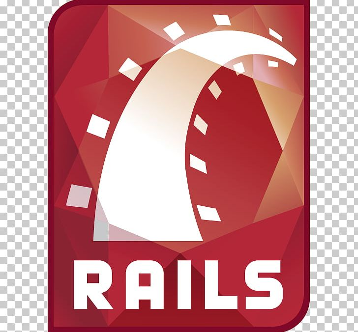

## 
<b>Hi there 👋 , I'm Miguel</b>

### What i create with:

<b>Backend</b> &bull;  &bull;  &bull;  &bull;  &bull; 
 
<b>Frontend</b> &bull;  &bull;  &bull;  &bull; 
 
<b>Database</b> &bull;  &bull; 
 
<b>Server</b> &bull;  &bull;  &bull;  &bull; 

<!--
**mfpbbr/mfpbbr** is a ✨ _special_ ✨ repository because its `README.md` (this file) appears on your GitHub profile.

Here are some ideas to get you started:

- 🔭 I’m currently working on ...
- 🌱 I’m currently learning ...
- 👯 I’m looking to collaborate on ...
- 🤔 I’m looking for help with ...
- 💬 Ask me about ...
- 📫 How to reach me: ...
- 😄 Pronouns: ...
- ⚡ Fun fact: ...
-->
