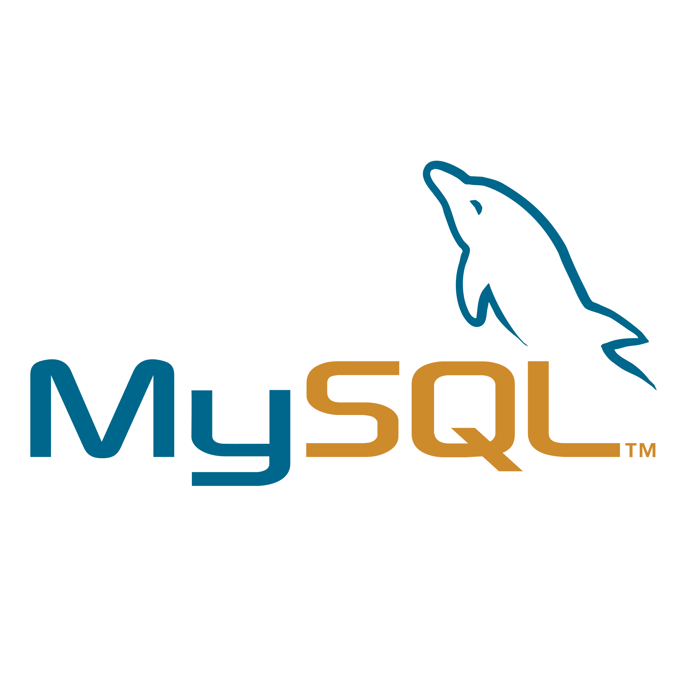

### Hi there 👋

# 
I'm Miguel

## About me

- 💻 I’m a full stack developer.

- 👶 I was born in Rio de Janeiro, Brasil.

- 🏡 I still live in Rio since then.

- 🎙️ I started coding in 2010.

- 💼 I’m cofounder of Yedinc

- 📚 I’m currently developing in Nextjs.

- ✍️ I will start writing some articles soon..

## Languages and tools

### Frontend:

 &bull;  &bull;  &bull;  &bull;  &bull;  &bull;  &bull;  &bull;  &bull;  &bull;  &bull; 

### Backend:

 &bull;  &bull;  &bull;  &bull;  &bull;  &bull; 

### Database:

 &bull; 

### Devops:

 &bull;  &bull;  &bull;  &bull; 

### Software:

 &bull;  &bull;  &bull;  &bull; 

### Others:

 &bull;  &bull; 

## On Github

<!--
**mfpbbr/mfpbbr** is a ✨ _special_ ✨ repository because its `README.md` (this file) appears on your GitHub profile.

Here are some ideas to get you started:

- 🔭 I’m currently working on ...
- 🌱 I’m currently learning ...
- 👯 I’m looking to collaborate on ...
- 🤔 I’m looking for help with ...
- 💬 Ask me about ...
- 📫 How to reach me: ...
- 😄 Pronouns: ...
- ⚡ Fun fact: ...
-->
